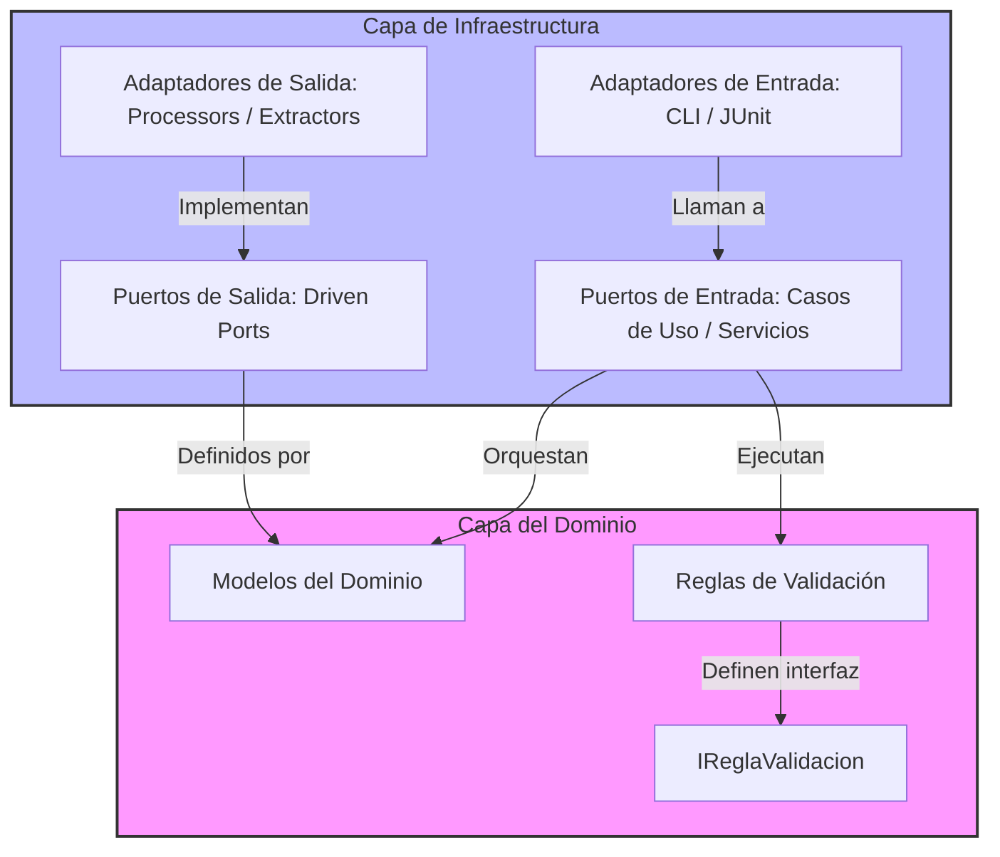

# Sistema Forense de Autenticidad de Archivos e Imágenes (PSD & PNG/JPG)

Este proyecto implementa una herramienta avanzada de peritaje forense digital diseñada para verificar la autenticidad de archivos de diseño compuesto de Adobe Photoshop (`.psd`) y sus correspondientes exportaciones en imágenes (`.png`, `.jpg`, `.jpeg`). Su objetivo principal es asegurar la integridad del trabajo técnico, detectando posibles fraudes estructurales (como imágenes planas pegadas en un PSD ficticio) y analizando la similitud visual mediante algoritmos perceptuales.

Este documento detalla los aspectos arquitectónicos, técnicos y teóricos del sistema, sirviendo como base conceptual y documental para la redacción de la tesis de grado.

---

## 1. Arquitectura del Sistema: Hexagonal (Puertos y Adaptadores)

El sistema ha sido reestructurado utilizando la **Arquitectura Hexagonal (Ports & Adapters)**. Esta arquitectura aísla las reglas de negocio y los modelos de dominio (el núcleo o *Core*) de los detalles tecnológicos e infraestructura externa (librerías de extracción de metadatos, carga de archivos o entrada/salida por consola).

### Diagrama de Arquitectura


### Organización de Paquetes
```text
org.example.analisis
├── core/                                   <-- Núcleo Puro del Negocio (Sin dependencias externas)
│   ├── model/                              <-- Modelos de Dominio (Entidades y Value Objects)
│   │   ├── base/                           <-- ArchivoBase (Abstracción de archivo analizable)
│   │   ├── imagen/                         <-- ArchivoImagen, MetadatosImagen, EstructuraImagen
│   │   ├── psd/                            <-- ArchivoPSD, EstructuraCapaPSD, MetadatosPSD
│   │   └── validacion/                     <-- ResultadoValidacion, VeredictoFinal
│   ├── rules/                              <-- Reglas de validación forense de negocio
│   │   ├── IReglaValidacion.java           <-- Interfaz de estrategia para reglas
│   │   ├── imagen/                         <-- Reglas de coherencia y origen de PNG/JPG
│   │   └── psd/                            <-- Reglas estructurales de capas de PSD
│   ├── ports/                              
│   │   └── out/                            <-- Puertos de Salida (Driven Ports)
│   │       └── ArchivoProcessorPort.java   <-- Interfaz de carga y análisis
│   └── service/                            <-- Servicios internos (ValidadorGenerico, PHash)
│
└── infrastructure/                         <-- Detalles Tecnológicos e Implementaciones
    └── adapters/                           
        ├── extractors/                     <-- Adaptadores de metadatos (PNG, JPEG, PSD, Exif, Xmp, etc.)
        │   └── MetadataExtractor.java      <-- Interfaz de infraestructura (acoplada a com.drew.metadata)
        └── processors/                     <-- Implementaciones de ArchivoProcessorPort
            ├── ArchivoImagenProcessor.java
            ├── ArchivoPSDProcessor.java
            └── ImageLoader.java            <-- Cargador optimizado de imágenes
```

* **Regla de Dependencia:** El código dentro de `core` no importa librerías externas. La única excepción era la extracción de metadatos mediante `metadata-extractor` (`com.drew.metadata`), la cual fue desacoplada con éxito moviendo la interfaz `MetadataExtractor` a la capa de `infrastructure.adapters.extractors`, asegurando la pureza total del dominio.

---

## 2. Elementos Estructurales Analizados para la Validación

Para emitir un veredicto de autenticidad sobre un archivo, el sistema inspecciona diversos marcadores físicos y binarios dentro de la estructura interna del contenedor de datos:

### A. Para Imágenes (PNG / JPEG)
1. **Firma Estructural Binaria (Magic Numbers):**
   * Se verifica el bloque de bytes inicial del archivo para validar su formato real en lugar de confiar en la extensión de su nombre.
   * **PNG:** `89 50 4E 47` (los primeros 4 bytes).
   * **JPEG:** `FF D8 FF` (los primeros 3 bytes).
   * *Propósito:* Detectar fraudes de renombrado simple (cambiar la extensión `.jpeg` a `.png` o viceversa).
2. **Coherencia DPI e Integridad Física:**
   * Se lee el bloque `pHYs` en PNG (Densidad de píxeles física por unidad) o la resolución en los metadatos `JFIF` / `Exif` en JPEG.
   * Se contrasta con las dimensiones físicas del lienzo.
3. **Análisis de Origen (Metadatos Exif / ICC):**
   * Rastreo del software editor en las cabeceras (Adobe Photoshop, GIMP, etc.) y la firma del perfil de color ICC (como `sRGB IEC61966-2.1` o `Adobe RGB`).

### B. Para Archivos PSD (Adobe Photoshop)
1. **Cabecera Binaria (`8BPS`):**
   * Firma física de inicio del archivo PSD. Se valida profundidad de bits (8/16 bits por canal) y modo de color (RGB, CMYK, etc.).
2. **Detección y Filtro de Capas de Trabajo (Autenticidad Técnica):**
   * El sistema parsea la sección de recursos de capas del PSD y evalúa la presencia de "valor técnico agregado". Se consideran capas de trabajo aquellas que:
     * Tienen **máscaras de capa** (`layer mask`).
     * Tienen **efectos de capa** aplicados (sombras, trazos, etc.).
     * Son **máscaras de recorte** (`clipping masks`).
     * Son **capas de texto** (`Text Layer`).
     * Tienen una opacidad menor al 100% o modos de fusión distintos a "Normal" (ej. *Multiply*, *Screen*, *Overlay*).
3. **Regla de Imagen Pegada (Flattened Fraud):**
   * Uno de los fraudes más comunes en entregas de diseño consiste en crear un PSD que contiene únicamente la imagen final exportada pegada en una sola capa plana, simulando que fue diseñado en capas.
   * **Validación:** Si el archivo tiene $\leq 3$ capas, se exige que al menos 1 sea clasificada como técnica. Si tiene más de 3 capas, se exige que al menos 2 contengan valor técnico. Si no se cumple esto, el peritaje reporta cortocircuito inmediato por **fraude de imagen pegada** (Autenticidad Técnica Falsa).

---

## 3. Estrategias de Optimización de Memoria

El procesamiento forense digital suele requerir la carga de archivos sumamente pesados (e.g., PSDs de más de 250 MB). Para evitar problemas de desbordamiento de memoria (`java.lang.OutOfMemoryError`), el sistema utiliza dos estrategias de optimización crítica:

### A. Extracción Estructural por Streams Parciales
Para obtener la estructura de capas del PSD, no se decodifican los lienzos gráficos de cada capa. En su lugar, el sistema realiza una lectura secuencial parcial a nivel binario (`byte-stream`) de las cabeceras y descriptores de capas. Esto permite mapear 123 capas de un archivo de 250 MB en un tiempo récord de **25 ms** consumiendo menos de 1 MB de RAM.

### B. Submuestreo de Imagen en Memoria (`Subsampling`)
Al realizar la comparación visual con pHash, cargar dos lienzos de alta definición de forma completa (e.g. $4320 \times 5400$ píxeles a $600$ DPI) consumiría cientos de megabytes de RAM en decodificar los búferes de color.
* **Solución:** `ImageLoader.loadWithSubsampling` configura parámetros de lectura optimizada a nivel de `ImageReader` (usando `ImageReadParam.setSourceSubsampling`).
* **Mecanismo:** Lee solo 1 de cada $N$ píxeles (reducción por cuadrícula) directamente durante la decodificación del archivo a memoria. El lienzo completo nunca se materializa en RAM en su resolución nativa.
* **Resultado:** Reducción del consumo de memoria en un **90% - 95%** durante el cálculo del pHash y una velocidad de comparación de **1.2 segundos** para archivos masivos.

---

## 4. Algoritmo de Similitud Perceptual: pHash (Perceptual Hashing)

A diferencia de los hashes criptográficos (como MD5 o SHA-256), que son extremadamente sensibles a la alteración de un solo bit, el **Hash Perceptual (pHash)** genera una firma visual de la imagen basada en sus frecuencias espaciales dominantes:

1. **Reducción de Escala y Color:** La imagen es escalada a un tamaño pequeño (ej. $32 \times 32$) y convertida a escala de grises.
2. **Transformada de Coseno Discreta (DCT):** Se calcula la DCT para pasar la imagen del dominio espacial al de frecuencia.
3. **Filtro de Frecuencia:** Se extrae el bloque superior izquierdo de la DCT (frecuencias bajas y medias), que representa la estructura visual fundamental que percibe el ojo humano.
4. **Binarización:** Se calcula el valor promedio de la DCT y se asigna un bit `1` a cada elemento que sea superior al promedio y `0` al inferior, resultando en una cadena de 64 bits.
5. **Distancia Hamming:** Para comparar la imagen exportada (PNG) contra la composición pre-renderizada del PSD, se calcula la distancia Hamming (cantidad de bits diferentes).
   * Una distancia Hamming de `0` (similitud del 100%) indica que la imagen exportada procede de forma exacta del PSD renderizado.

---

## 5. Patrones de Diseño Implementados

El diseño de software del sistema aplica patrones de diseño de la *Pandilla de los Cuatro* (GoF) para garantizar la flexibilidad del negocio:

1. **Patrón Strategy (Estrategias de Reglas):**
   * La interfaz [`IReglaValidacion<T>`](file:///c:/Users/Edlith%20Vinueza/Documents/UCE%2026-26/Tesis/pruebas_archivos_e_imagenes/src/main/java/org/example/analisis/core/rules/IReglaValidacion.java) actúa como una estrategia común. Cada regla concreta implementa su propia validación. El [`ValidadorGenericoService`](file:///c:/Users/Edlith%20Vinueza/Documents/UCE%2026-26/Tesis/pruebas_archivos_e_imagenes/src/main/java/org/example/analisis/core/service/ValidadorGenericoService.java) es agnóstico del comportamiento de las reglas: solo las itera y acumula el veredicto final.
2. **Patrón Factory Method (Fábrica de Procesadores):**
   * El cliente utiliza [`ArchivoProcessorFactory`](file:///c:/Users/Edlith%20Vinueza/Documents/UCE%2026-26/Tesis/pruebas_archivos_e_imagenes/src/main/java/org/example/analisis/core/service/ArchivoProcessorFactory.java) para obtener el procesador correcto. La fábrica encapsula la lógica de firmas binarias para decidir si devuelve un `ArchivoImagenProcessor` o un `ArchivoPSDProcessor`.
3. **Patrón Builder:**
   * Utilizado a través de las anotaciones `@Builder` de Lombok para los objetos de datos complejos como `ArchivoPSD` o `ArchivoImagen`, previniendo constructores masivos y promoviendo la inmutabilidad.
