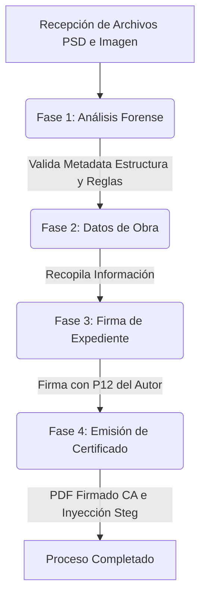
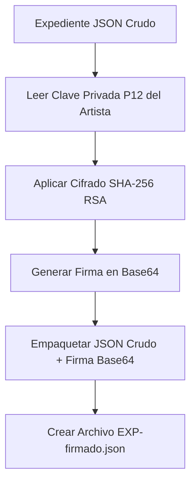
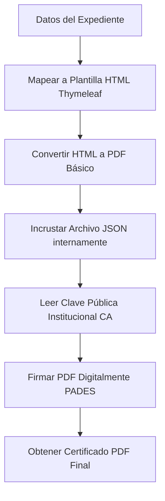

# Documentación del Sistema de Certificación Forense Verisart

## Propósito del Proyecto
El Sistema de Certificación Forense  es una plataforma orientada a obras gráficas digitales. Su propósito principal es analizar, preservar y registrar evidencias de autoría mediante procedimientos forenses, criptográficos y documentales.
El sistema genera evidencia técnica verificable que permite demostrar la existencia de una obra digital en un momento determinado y conserva información relevante sobre su proceso de creación y autenticidad.

---

## Flujo General del Sistema

El sistema opera bajo un flujo de estados claramente definidos utilizando el patrón **State**.



---

## Detalles Técnicos por Fase

### Fase 1: Análisis Forense Digital
Esta fase representa el filtro crítico para asegurar que las obras no han sido falsificadas. Se divide en el análisis estructural a bajo nivel y las validaciones forenses.

** Dependencias Involucradas:**
*   `com.drewnoakes:metadata-extractor`: Extracción de metadatos profundos (EXIF, perfiles de color) de las imágenes.
*   `com.twelvemonkeys.imageio:imageio-psd` (y sus módulos core): Permite renderizar y leer archivos PSD usando `ImageIO.read()` para lograr hacer el compositeado (combinación visual) de todas las capas y generar la imagen comparativa del pHash.

 **Fragmento de Ejecución (ProcesoCertificacionTest.java):**
```java
// ══════════════════════════════════════════════════════════════════════
// FASE 1 — Análisis Forense
// ══════════════════════════════════════════════════════════════════════
System.out.println("\n FASE 1 — ANÁLISIS FORENSE");

ArchivoPSD psd = ((ArchivoProcessorPort<ArchivoPSD>) factory.getProcessor(archivoPSD)).procesar(archivoPSD);
ArchivoImagen imagen = ((ArchivoProcessorPort<ArchivoImagen>) factory.getProcessor(archivoImagen)).procesar(archivoImagen);

// Validar reglas forenses
VeredictoFinal veredictoPSD = validadorPSD.validar(psd);
VeredictoFinal veredictoImagen = validadorImagen.validar(imagen);

// pHash comparativo
BufferedImage imgPSD = ImageLoader.loadWithSubsampling(archivoPSD);
BufferedImage imgImagen = ImageLoader.loadWithSubsampling(archivoImagen);
String pHash = calcPHash.generarHash(imgImagen);
double similitud = calcPHash.compararSimilitud(calcPHash.generarHash(imgPSD), pHash);
assertTrue(similitud >= 95.0, "La similitud visual de los archivos originales debería ser excelente");
```

#### Análisis de Metadatos y Estructura a Bajo Nivel (PSD e Imágenes)
El sistema no confía en la extensión del archivo, ya que este puede ser alterado por alguien que posea estos conocimientos . En lugar de cargar las imágenes completas en la memoria RAM (lo cual podría causar un `OutOfMemoryError` con archivos muy pesados), el sistema utiliza lectura secuencial binaria (`DataInputStream`). Se aplican saltos estratégicos (`skipBytes`) para descartar los bloques de píxeles puros y parsear únicamente las cabeceras binarias y la metadata esencial.

**Para archivos PSD:** Se valida la firma "8BPS" y se analizan las dimensiones, la cantidad de canales y los detalles de cada capa sin renderizarla.
**Ubicación:** `src/main/java/ec/edu/uce/certificadorforense/infrastructure/adapters/processors/ExtractorCapasPSD.java`.

```java
// Ahorro de Memoria: Lectura de capas descartando los bytes de los píxeles (skipBytes)
int cantidadCapas = Math.abs(dis.readShort());
for (int i = 0; i < cantidadCapas; i++) {
    int top = dis.readInt();
    int left = dis.readInt();
    int bottom = dis.readInt();
    int right = dis.readInt();
    
    // Saltamos los datos pesados de la imagen para ahorrar RAM
    skipExacto(dis, 4); // Firma "8BIM"
    byte[] blendBytes = new byte[4];
    dis.readFully(blendBytes);
    // ... se extrae metadatos capa por capa (nombre, opacidad, modos de fusión)
}
```

**Para imágenes exportadas (PNG / JPEG):** Se buscan firmas hexadécimales específicas y se extrae la densidad de píxeles (DPI) buscando el chunk `pHYs` en PNG o el segmento `APP0` en JPEG.
**Ubicación:** `src/main/java/ec/edu/uce/certificadorforense/infrastructure/adapters/processors/ResolucionFisica.java`.

```java
// Fragmento de búsqueda del chunk pHYs en imágenes PNG sin cargar la imagen a RAM
private static int[] buscarDpiPng(DataInputStream dis) throws IOException {
    dis.skipBytes(8); // Salta la firma PNG
    while (dis.available() > 0) {
        int length = dis.readInt();
        byte[] type = new byte[4];
        dis.readFully(type);
        if ("pHYs".equals(new String(type))) {
            int x = dis.readInt();
            int y = dis.readInt();
            if (dis.readByte() == 1) { // 1 = Unidad en Metros
                return new int[]{ (int)Math.round(x * 0.0254), (int)Math.round(y * 0.0254) };
            }
            break;
        }
        dis.skipBytes(length + 4); // Salta Datos + CRC si no es el chunk buscado
    }
    return new int[]{72, 72}; // DPI por defecto
}
```

#### Validación de Reglas (Patrón Strategy)
Una vez que el archivo es parseado a un objeto de dominio (`ArchivoPSD` o `ArchivoImagen`), se somete a validaciones usando un Validador Genérico basado en el patrón Strategy.
 **Ubicación:** `src/main/java/ec/edu/uce/certificadorforense/core/service/ValidadorGenericoService.java`

```java
public VeredictoFinal validar(T objeto) {
    VeredictoFinal veredicto = new VeredictoFinal();
    for (IReglaValidacion<T> regla : reglas) {
        ResultadoValidacion resultado = regla.validar(objeto);
        veredicto.agregarResultado(resultado, regla.esCritica());
        if (veredicto.isEsRechazado()) {
            break; // Cortocircuito si la regla es crítica
        }
    }
    return veredicto;
}
```

#### Comparación Perceptual (pHash)
Se valida si el lienzo interno del PSD y la imagen renderizada final (PNG/JPG) se ven igual para el ojo humano (>= 95% de similitud).
 **Ubicación:** `src/main/java/ec/edu/uce/certificadorforense/core/service/CalculadorPHash.java`

```java
public String generarHash(BufferedImage imagen) {
    // 1. Redimensionar a 8x8 para normalizar
    Image escala = imagen.getScaledInstance(8, 8, Image.SCALE_SMOOTH);
    // ...
    // 3. Generar cadena binaria de 64 bits basada en el brillo promedio
    StringBuilder hash = new StringBuilder();
    for (int y = 0; y < 8; y++) {
        for (int x = 0; x < 8; x++) {
            hash.append((miniatura.getRGB(x, y) & 0xFF) >= promedio ? "1" : "0");
        }
    }
    return hash.toString();
}
```

---

### Fase 2: Datos de la Obra y Autor
En esta fase, **el sistema solicita la información declarativa** por parte del artista. A diferencia de la Fase 1 que es completamente automatizada, aquí el sistema recolecta los datos legales y descriptivos que el autor declara sobre su identidad y su creación. 

** Dependencias Involucradas:**
*   `com.google.code.gson:gson`: Serialización profunda para convertir el objeto `Expediente` (y todos sus campos anidados de fases anteriores) de manera determinista en un JSON estructurado.
*   `org.projectlombok:lombok`: Utilizado extensamente aquí a través del patrón `@Builder` para instanciar las entidades del dominio de forma limpia sin código repetitivo (Boilerplate).

Una vez recolectados estos datos, el sistema los fusiona con los resultados forenses de la Fase 1 y genera el objeto de dominio principal llamado `Expediente`.

**Estructura del Expediente consolidado:**
*   **Autor (Datos declarados):** Nombres, cédula, correo, seudónimo.
*   **Obra (Datos declarados):** Título, descripción, software, hardware, categoría.
*   **AnalisisResumen (Datos forenses automáticos):** Resultado (APROBADO/RECHAZADO), número de capas PSD, dimensiones, detalles técnicos.
*   **HashesEvidencia (Datos criptográficos automáticos):** SHA-512 del PSD, SHA-512 de la Imagen, pHash.

 **Ubicación:** Las pruebas de integración en `src/test/java/ec/edu/uce/certificadorforense/ProcesoCertificacionTest.java` ilustran cómo se introducen estos datos en el flujo.

```java
// ══════════════════════════════════════════════════════════════════════
// FASE 2 — Datos de la Obra
// ══════════════════════════════════════════════════════════════════════
System.out.println("\n FASE 2 — DATOS DE LA OBRA");

Autor autor = Autor.builder()
        .nombres("Artista")
        .apellidos("Test")
        .cedula("0000000000")
        .correo("artista@test.com")
        .seudonimo("Test_Art")
        .build();

Obra obra = Obra.builder()
        .titulo("Obra de Integracion")
        .descripcion("Prueba general")
        .software("TestSoft")
        .hardware("Tableta Gráfica Wacom")
        .categoria(CategoriaObra.ILUSTRACION)
        .fechaCreacion(LocalDate.now())
        .build();

Declaraciones declaraciones = Declaraciones.builder()
        .titularDerechos(true)
        .entiendeCertificacionTecnica(true)
        .aceptaTerminos(true)
        .build();

contexto.setAutor(autor);
contexto.setObra(obra);
contexto.setDeclaraciones(declaraciones);
contexto.getEstadoActual().avanzar(contexto);
```

Como resultado de proveer esta información declarativa, el servicio `ExpedienteService` consolida y retorna un objeto que posteriormente se guarda como un archivo JSON con la siguiente estructura (la cual será firmada en la próxima fase):

```json
{
  "idExpediente": "EXP-2026-000001",
  "fechaRegistro": "2026-06-21T21:05:38.774076200Z",
  "autor": {
    "nombres": "Artista",
    "apellidos": "Test",
    "cedula": "0000000000",
    "correo": "artista@test.com",
    "seudonimo": "Test_Art"
  },
  "obra": {
    "titulo": "Obra de Integracion",
    "descripcion": "Prueba general",
    "software": "TestSoft",
    "hardware": "Tableta Gráfica Wacom",
    "categoria": "ILUSTRACION",
    "fechaCreacion": "2026-06-21"
  },
  "analisis": {
    "resultado": "APROBADO",
    "capasPSD": 123,
    "metadatosDetectados": true,
    "dimensiones": "4320 x 5400 px",
    "detallesTecnicos": "Ilustración, 600 DPI, RGB"
  },
  "hashes": {
    "sha512PSD": "0e971e9a0b2c3ef315de5cd456c4109de9ca11f0c02234cff208fd2b9af5bce4bbab3bfa1153f6547ca81314d2adb348b498db07482e78ef12d9951381331a16",
    "sha512Imagen": "e7056131149e9806822002d75fb3617fd31633003ce39f1c7b1cab19e4fb3ed80f83938cba28134916b06aa8b3605a7aa93ac21bf42d12f8c68f9b86ef0f58ae",
    "pHash": "0000000100110011001110011111100111111001001110000011010000010010"
  }
}
```

---

### Fase 3: Firma del Expediente y Almacenamiento
Una vez estructurado el expediente en la Fase 2, se procede a su firma criptográfica y guardado en disco. El flujo de firma se describe a continuación:



** Dependencias Involucradas:**
*   `java.security.*` (Nativo de Java): Para la instanciación del `KeyStore` y `Signature`. No se requiere depender de librerías de terceros engorrosas para firmar un JSON, demostrando independencia técnica.
*   (Opcional / Indirecto) `org.bouncycastle`: Se incluye a nivel de proyecto para que sirva de proveedor de seguridad reforzado si Java Security lo demanda en configuraciones más estrictas.

 **Fragmento de Ejecución (ProcesoCertificacionTest.java):**
```java
// ══════════════════════════════════════════════════════════════════════
// FASE 3 — Firma del Autor
// ══════════════════════════════════════════════════════════════════════
System.out.println("\n FASE 3 — FIRMA DEL AUTOR");

Expediente expediente = expedienteServ.construir(contexto);
String expedienteJson = gson.toJson(expediente); // Construcción y serialización explicada en Fase 2

// Validación estricta del P12 del autor antes de firmar
assertDoesNotThrow(() -> firmaServ.validar(p12Autor, PASS_AUTOR), "La validación del p12 del artista falló");

// Firma criptográfica del payload JSON con la clave privada
FirmaAutor firma = firmaServ.firmar(expedienteJson, p12Autor, PASS_AUTOR);

contexto.setFirmaAutor(firma);
publisher.publicar(new EventoFirmaRealizada(expediente, expedienteJson, firma));
```

**Proceso de Almacenamiento (Archivos Firmados vs No Firmados):**
Al guardar el expediente, el adaptador genera **dos archivos distintos** para asegurar la trazabilidad y la validación posterior:
1.  **Expediente sin firmar (`EXP-YYYY-NNNNNN.json`):** Contiene únicamente la estructura de datos en crudo del objeto de dominio (`Autor`, `Obra`, `Analisis`, `Hashes`).
2.  **Expediente firmado (`EXP-YYYY-NNNNNN-firmado.json`):** Es un "Wrapper" que empaqueta el JSON original inalterado en un atributo `expedienteJson`, y añade un segundo atributo `firmaBase64` con el resultado criptográfico de la firma del autor.

 **Ubicación Firma:** `src/main/java/ec/edu/uce/certificadorforense/infrastructure/adapters/firma/FirmadorP12Adapter.java`
 **Ubicación Guardado:** `src/main/java/ec/edu/uce/certificadorforense/infrastructure/adapters/json/ExpedienteJsonAdapter.java`

```java
// Fragmento de Guardado Diferenciado (ExpedienteJsonAdapter)
// 1. Guardar expediente base (JSON del dominio sin firmar)
String nombreBase = expediente.getIdExpediente() + ".json";
Files.writeString(dir.resolve(nombreBase), expedienteJson, StandardCharsets.UTF_8);

// 2. Guardar también el wrapper con la firma
String nombreFirmado = expediente.getIdExpediente() + "-firmado.json";
String wrapperJson = gson.toJson(new ExpedienteFirmadoWrapper(expedienteJson, firmaBase64));
Files.writeString(dir.resolve(nombreFirmado), wrapperJson, StandardCharsets.UTF_8);
```

```java
// Fragmento de validación de firma en FirmadorP12Adapter
KeyStore keystore = KeyStore.getInstance("PKCS12");
keystore.load(new FileInputStream(p12File), password.toCharArray());
// Extracción del Alias y validación de vigencia
String alias = keystore.aliases().nextElement();
X509Certificate cert = (X509Certificate) keystore.getCertificate(alias);
cert.checkValidity(); // Lanzará excepción si expiró
```

---

### Fase 4: Emisión del Certificado
El último paso corresponde a la generación documental. Se inyectan las variables al PDF vía **Thymeleaf + iText 7**. Finalmente, si el archivo es PNG, se aplica esteganografía.

El flujo de certificación documental se describe a continuación:



** Dependencias Involucradas:**
*   `com.google.zxing:core` / `javase`: Generación dinámica de códigos QR que apuntan a la URL de validación del sistema (o al ID interno generado).
*   `com.itextpdf:itext7-core` / `sign` / `html2pdf`: Motor principal para convertir la plantilla HTML en un documento PDF y aplicar la firma criptográfica avanzada (PADES) empleando el certificado CA (`root_ca.p12`).
*   `org.thymeleaf:thymeleaf`: Procesamiento y renderizado del template HTML de la certificación.
*   `org.bouncycastle`: Interviene nuevamente como el proveedor criptográfico por defecto de iText 7 para operaciones de firma.

📍 **Fragmento de Ejecución (ProcesoCertificacionTest.java):**
```java
// ══════════════════════════════════════════════════════════════════════
// FASE 4 — Emisión del Certificado
// ══════════════════════════════════════════════════════════════════════
System.out.println("\n FASE 4 — EMISIÓN DEL CERTIFICADO");

Certificado certificado = certServ.generar(expediente.getIdExpediente(), expedienteFirmadoJson);

// 1. Generar el PDF y firmarlo con el root_ca.p12 institucional
byte[] pdfSinFirmar = generadorPDF.generar(certificado, expediente, expedienteFirmadoJson, imagenBase64);
byte[] pdfFirmado = firmadorPDF.firmarPDF(pdfSinFirmar, PASS_CA);
contexto.setPdfCertificado(pdfFirmado);

// 2. Esteganografía (Solo si es PNG)
String jsonEstegano = "{\"id\":\"" + certificado.getIdCertificado() + "\",\"hash\":\"" + certificado.getHashExpedienteFirmado() + "\"}";
if (extension.equalsIgnoreCase("png")) {
    byte[] imgBytes = Files.readAllBytes(archivoImagen.toPath());
    byte[] imagenCert = estegano.inyectar(imgBytes, jsonEstegano);
    Files.write(dirSalida.resolve("obra-certificada.png"), imagenCert);
}

// 3. Guardar el PDF final
Files.write(dirSalida.resolve(certificado.getIdCertificado() + "-" + extension + ".pdf"), contexto.getPdfCertificado());
```
 **Ubicación Esteganografía Subyacente:** `src/main/java/ec/edu/uce/certificadorforense/infrastructure/adapters/esteganografia/EsteganografiaPNGAdapter.java`

```java
// Inserción silenciosa de chunk tEXt en PNG a nivel binario
byte[] chunkData = construirChunkTexto(jsonCertificacion);
int posicionIEND = buscarPosicionIEND(imagenOriginal);
baos.write(imagenOriginal, 0, posicionIEND);
baos.write(chunkData); // Se inyecta antes del EOF sin modificar píxeles
```

### ¿Qué se inserta exactamente en cada archivo?
Es vital comprender que **no se inserta todo el expediente en la imagen**, ya que eso la haría demasiado pesada o susceptible a corrupción. Se utiliza un enfoque de "enlace criptográfico".

**1. En la Obra Esteganografiada (El PNG):**
Se inyecta única y exclusivamente un "Payload" o mini-JSON que actúa como ancla hacia la base de datos del sistema. Este texto se esconde en un chunk `tEXt` justo antes del marcador `IEND` (final del archivo).
```json
{
  "id": "EXP-2026-000001",
  "hash": "a4d8b9... (Hash SHA-256 de la firma del Expediente)"
}
```
*   **¿Por qué solo esto?:** Si alguien roba la imagen, un perito puede extraer este mini-JSON oculto, usar el `id` para buscar el registro original en nuestro sistema, y usar el `hash` para demostrar que la imagen robada pertenece a ese expediente exacto de la base de datos.

**2. En el Certificado (El PDF):**
El PDF recibe 3 niveles de seguridad pesada:
*   **A nivel visual:** Textos legibles y el Código QR de validación.
*   **A nivel binario (Archivo Adjunto):** El sistema **incrusta literalmente el archivo `expediente-firmado.json` íntegro** dentro de la estructura del PDF (como si fuera un clip de attachment).
*   **A nivel criptográfico:** El archivo PDF completo es envuelto y firmado digitalmente (PADES) usando la clave privada `root_ca.p12`. Si alguien altera el PDF, la firma se rompe inmediatamente.

---

## Arquitectura y Patrones de Diseño

El sistema está construido siguiendo los principios de la **Arquitectura Hexagonal**. Esto desacopla completamente el dominio y las reglas de validación forense de los mecanismos externos.

### Patrones Utilizados:
1.  **Patrón State:** Gobierna la transición estricta entre las Fases del proceso. Impide que se salten validaciones.
2.  **Patrón Observer:** Gestiona la publicación de eventos (`EventoAnalisisIniciado`, `EventoFirmaRealizada`, etc.) permitiendo a módulos reaccionar sin acoplar el código central.
3.  **Patrón Strategy:** Validaciones intercambiables.
4.  **Patrón Adapter/Ports:** Define contratos (`Ports`) en el *Core* resueltos en *Infraestructura* (Ej. `EsteganografiaPort` -> `EsteganografiaPNGAdapter`).

---

# Justificación de las Decisiones Arquitectónicas y Alcance Jurídico del Sistema

## Naturaleza del Sistema
La plataforma no tiene como objetivo reemplazar a las entidades gubernamentales encargadas del registro de propiedad intelectual, ni actuar como una Autoridad de Certificación acreditada para la emisión de certificados electrónicos con validez jurídica estatal. Su función consiste en generar evidencia técnica verificable que permita demostrar la existencia de una obra digital en un momento determinado.

## Independencia de Organismos Gubernamentales
Se decidió deliberadamente que el sistema opere de manera independiente de organismos estatales o entidades certificadoras oficiales debido a:

### 1. Alcance académico y de investigación
El proyecto corresponde a un prototipo tecnológico desarrollado con fines académicos y de investigación. Implementar una infraestructura equivalente a una Autoridad de Certificación oficial excede los objetivos y recursos.

### 2. Complejidad regulatoria
Las Autoridades oficiales deben cumplir requisitos (Auditorías, HSMs, políticas formales) que no forman parte del alcance de este trabajo.

### 3. Enfoque en evidencia técnica
El valor principal del sistema no radica en la emisión de certificados oficiales, sino en la **evidencia técnica verificable** mediante análisis forense, hashes SHA-512, esteganografía y firma electrónica.

### 4. Portabilidad tecnológica
Al no depender de plataformas gubernamentales, el sistema puede ejecutarse localmente o desplegarse en cualquier nube sin modificaciones sustanciales.

## Uso de una Autoridad Certificadora Propia
El sistema incorpora un certificado institucional propio (`root_ca.p12`) utilizado exclusivamente para firmar los certificados emitidos por la plataforma. Esto garantiza la integridad del documento y mantiene una cadena de confianza interna.

## Relación con la Propiedad Intelectual
La certificación emitida no reemplaza el registro formal de derechos de autor. Constituye un **mecanismo complementario de respaldo técnico** que permite demostrar la existencia previa de una obra y preservar evidencia de creación.

## Justificación de la Arquitectura Hexagonal
La adopción de arquitectura hexagonal responde a la necesidad de desacoplar completamente la lógica de negocio de los mecanismos de almacenamiento. Permite migrar de una aplicación local a web o incorporar integraciones futuras de manera limpia y mantenible.

---

# ¿Por qué usamos una ROOT CA propia en lugar de depender de entidades externas?

En una Infraestructura de Clave Pública (PKI), la confianza no es automática: se construye mediante una jerarquía de autoridades certificadoras. En sistemas reales, esta confianza proviene de entidades externas. Sin embargo, en sistemas de investigación como nuestro sistema forense digital, se utiliza una ROOT CA propia.

En tu caso (sistema forense), NO existe acceso a una CA gubernamental real o integración con infraestructura nacional. Por lo tanto, necesitas crear tu propio punto de confianza.

### Razones Técnicas
1.  **Control total del sistema:** Se define quién firma, qué se firma y cómo se valida.
2.  **Sistema cerrado (forense):** El sistema no necesita ser válido en Internet, sino solo dentro de su ecosistema.
3.  **Simulación real de PKI:** Una ROOT CA propia reproduce la jerarquía de confianza, firma y verificación de integridad de forma idéntica a la vida real.
4.  **Independencia de terceros:** No se depende de gobiernos o empresas externas.
5.  **Reproducibilidad académica:** El sistema puede ejecutarse en cualquier máquina sin caducar o depender de APIs.

### Diferencia Clave con Sistemas Reales
| Característica | Mundo Real | Nuestro Sistema |
| --- | --- | --- |
| **ROOT CA** | Preinstalada globalmente en OS/Navegadores | Creada y validada localmente |
| **Validez Legal** | Estatal e Internacional | Académica / Soporte Técnico Forense |
| **Dependencia** | Alta (Entidades externas pagas/públicas) | Ninguna (Autónomo) |

### Justificación Académica para la Tesis
*En el presente sistema se implementa una Autoridad Certificadora raíz (ROOT CA) simulada, con el objetivo de establecer un punto de confianza dentro de una infraestructura de clave pública (PKI) cerrada.*

*En sistemas reales, la confianza en certificados digitales proviene de autoridades certificadoras raíz preinstaladas en sistemas operativos y navegadores, las cuales actúan como anclas de confianza global. Sin embargo, en entornos controlados o de investigación, no es posible ni necesario depender de infraestructuras externas.*

*Por ello, la ROOT CA implementada en este sistema cumple la función de autoridad de confianza interna, permitiendo la emisión y validación de certificados digitales utilizados para la firma de documentos, garantizando integridad y autenticidad dentro del sistema forense propuesto.*

### Recomendación en la Nube
Si el prototipo se despliega en la nube, es vital resguardar la ROOT CA de forma segura (Ej. `ca.path=/secure/root_ca.p12` mediante variables de entorno) y generar la CA una sola vez para no invalidar los certificados emitidos previamente.

---

# Estrategia de Almacenamiento a Futuro (Zero-File Retention)

El diseño arquitectónico del sistema estipula que a futuro **no se deben almacenar archivos físicos (ni PSD, ni PNG, ni PDF)** en la infraestructura del servidor, sino **únicamente datos (El Expediente JSON)**.

Esta decisión (estrategia *Data-Only* o *Zero-File Retention*) responde a las siguientes justificaciones técnicas y legales:

1.  **Ahorro Masivo de Costos:** Almacenar documentos JSON estructurados requiere un espacio minúsculo (KBs) en una base de datos (ej. campo `JSONB` en PostgreSQL), en comparación con los Gigabytes que requeriría alojar los archivos PSD e imágenes de alta resolución de cientos de artistas.
2.  **Cero Responsabilidad sobre Propiedad Intelectual:** Al no alojar las imágenes fuente, el sistema se exime de responsabilidades legales por filtración de obras de arte, robos o distribución no autorizada. El sistema actúa exclusivamente como un "Notario Digital", no como un disco duro.
3.  **La Criptografía Sustituye al Archivo:** No es necesario guardar el PSD para probar su existencia. La Fase 1 extrae el **Hash SHA-512** del archivo y lo sella dentro del Expediente JSON firmado. En el futuro, si el autor necesita defender su obra, simplemente presenta su PSD en un tribunal; al recalcular el hash de ese archivo, coincidirá matemáticamente con el hash perpetuado en los datos del sistema.
4.  **Generación Bajo Demanda:** El certificado PDF entregado al autor al final del proceso es responsabilidad del artista salvaguardarlo. Sin embargo, dado que el sistema conserva los datos inmutables del Expediente, el certificado PDF podría ser regenerado matemáticamente y vuelto a firmar por el sistema en cualquier momento si el usuario lo solicita.

---

# ANEXO: Modelo de Base de Datos Relacional (Implementación Futura)

Para soportar la estrategia arquitectónica descrita, el siguiente esquema de base de datos SQL define cómo persistir el proceso forense en una base de datos (Ej. PostgreSQL). Está fuertemente normalizado para evitar redundancia y proteger la inmutabilidad de los datos.

### Ciclo de Vida de Inserción (Mapping por Fases)
*   **Fase 1 (Análisis Forense):** Se crea el registro base en `expedientes` (Estado INICIAL) y se guarda el análisis extraído automáticamente en la tabla `analisis_forense`. *Nota: El hash del PSD es UNIQUE para evitar registros duplicados de la misma obra.*
*   **Fase 2 (Datos Declarados):** Se inserta o recupera al usuario en `autores` y se registra la información conceptual en la tabla `obras`. El expediente se actualiza para apuntar a la `obra_id`.
*   **Fase 3 (Firma Autor):** Se actualiza el `expediente_json` crudo en la tabla `expedientes` listo para firmar.
*   **Fase 4 (Certificación):** Se inserta el núcleo del sistema en la tabla `certificados` guardando la columna mágica de tipo `JSONB` con el Wrapper completo y validado. Opcionalmente, se guarda el registro de subida a AWS S3 (si aplica) en la tabla `archivos` (Solo PDF y PNG). Finalmente, se insertan logs legales en la tabla `auditoria`.

```sql
--  TABLA: autores (Fase 2)
CREATE TABLE autores (
    id UUID PRIMARY KEY,
    nombres VARCHAR(120) NOT NULL,
    apellidos VARCHAR(120) NOT NULL,
    cedula VARCHAR(20) UNIQUE NOT NULL,
    correo VARCHAR(150) UNIQUE NOT NULL,
    seudonimo VARCHAR(80),
    created_at TIMESTAMPTZ DEFAULT NOW()
);

--  TABLA: obras (Fase 2)
CREATE TABLE obras (
    id UUID PRIMARY KEY,
    autor_id UUID NOT NULL REFERENCES autores(id),

    titulo VARCHAR(255) NOT NULL,
    descripcion TEXT,
    categoria VARCHAR(50),

    software VARCHAR(120),
    hardware VARCHAR(120),
    fecha_creacion DATE,

    created_at TIMESTAMPTZ DEFAULT NOW()
);

--  TABLA: expedientes (Fase 1 a 3)
CREATE TABLE expedientes (
    id UUID PRIMARY KEY,
    codigo_expediente VARCHAR(30) UNIQUE NOT NULL,

    obra_id UUID REFERENCES obras(id), -- Nullable al inicio (Fase 1)

    estado VARCHAR(30) NOT NULL, 
    -- EJ: REGISTRADO, ANALIZADO, RECHAZADO, CERTIFICADO

    expediente_json JSONB NOT NULL,

    created_at TIMESTAMPTZ DEFAULT NOW(),
    updated_at TIMESTAMPTZ DEFAULT NOW()
);

--  TABLA: analisis_forense (Fase 1)
CREATE TABLE analisis_forense (
    id UUID PRIMARY KEY,
    expediente_id UUID NOT NULL REFERENCES expedientes(id),

    resultado VARCHAR(30) NOT NULL, 
    -- APROBADO / RECHAZADO

    capas_psd INT,
    metadatos_detectados BOOLEAN,
    dimensiones VARCHAR(50),
    detalles_tecnicos TEXT,

    hash_psd TEXT UNIQUE NOT NULL, -- UNIQUE crítico para evitar fraude (robos)
    hash_imagen TEXT NOT NULL,
    phash TEXT,

    created_at TIMESTAMPTZ DEFAULT NOW()
);

--  TABLA: certificados (Fase 4) (NÚCLEO INMUTABLE)
CREATE TABLE certificados (
    id UUID PRIMARY KEY,

    expediente_id UUID NOT NULL REFERENCES expedientes(id),
    obra_id UUID NOT NULL REFERENCES obras(id),
    autor_id UUID NOT NULL REFERENCES autores(id),

    hash_expediente_firmado TEXT NOT NULL,
    expediente_firmado_json JSONB NOT NULL, -- Single Source of Truth
    firma_base64 TEXT NOT NULL,
    algoritmo_firma VARCHAR(50) NOT NULL,

    estado VARCHAR(30) NOT NULL,
    -- CERTIFICADO / REVOCADO

    fecha_emision TIMESTAMPTZ DEFAULT NOW()
);

--  TABLA: archivos (Fase 4) (STORAGE EXTERNO - ZERO FILE RETENTION)
CREATE TABLE archivos (
    id UUID PRIMARY KEY,

    certificado_id UUID REFERENCES certificados(id),

    tipo VARCHAR(30) NOT NULL,
    -- NOTA: Según Zero-File Retention, solo debería haber tipos PNG_ESTEGANOGRAFIA o PDF_CERTIFICADO. 
    -- El archivo PSD no se almacena permanentemente.

    url TEXT NOT NULL, -- Ej: Enlace a AWS S3
    hash_archivo TEXT,

    creado_en TIMESTAMPTZ DEFAULT NOW()
);

--  TABLA: auditoria (Obligatorio para sistemas forenses)
CREATE TABLE auditoria (
    id UUID PRIMARY KEY,

    entidad VARCHAR(50), 
    entidad_id UUID,

    accion VARCHAR(50),
    -- CREATE, UPDATE, CERTIFY, VERIFY

    detalle TEXT,

    created_at TIMESTAMPTZ DEFAULT NOW()
);
```
