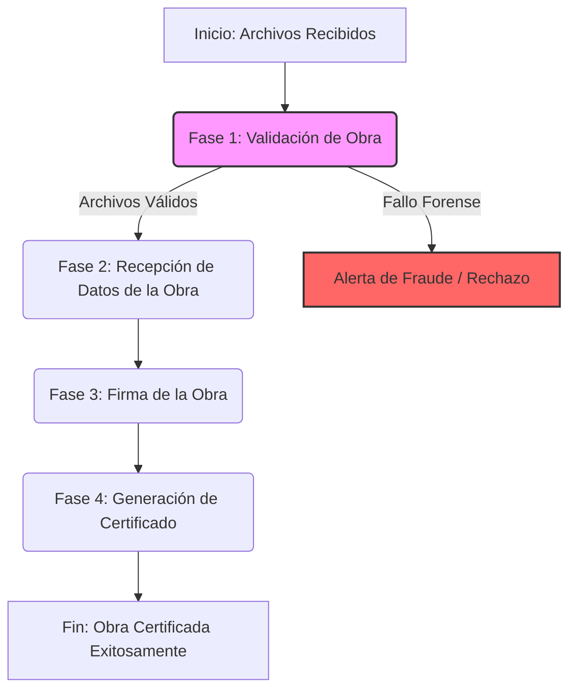

# Sistema de Análisis Forense de Archivos e Imágenes de Ilustraciones Digitales 

## Introducción

La función principal de este módulo es el **análisis forense digital**. Su objetivo  es analizar archivos **PSD** (el formato nativo exportable más común en software de dibujo, tanto gratuitos o como de suscripción o pago). 

El análisis se centra en los archivos **PSD** porque resulta ser el formato más factible de analizar. A diferencia de otros formatos nativos como `.mdp` o `.mdz`, que son de código propietario y cerrado, es muy fácil encontrar información detallada sobre cómo está estructurada la metadata y la distribución interna de capas de un archivo PSD. Este análisis profundo a nivel de capas es crítico, ya que basarse únicamente en la metadata tradicional es insuficiente y facilita posibles fraudes (como imágenes planas haciéndose pasar por trabajos complejos).

Además del análisis profundo de la estructura de archivos PSD, el módulo también está diseñado para analizar, validar y certificar archivos de imagen en formato **PNG** y **JPEG**, que son los formatos en los que se encuentran las obras terminadas en su totalidad. 

## Apartados Importantes / Conceptos Clave

* **[Validez Legal y Firma Criptográfica (Comparativa con FirmaEC de Ecuador)](docs/conceptos_clave/01_validez_legal_y_firma_ecuador.md)**
* **[Justificación del Sistema vs Blockchain y NFTs](docs/conceptos_clave/justificacion.md)**

## Documentación del Proyecto

El proyecto está estructurado de manera modular para garantizar su escalabilidad y fácil mantenimiento a lo largo de la tesis. Puedes consultar los detalles arquitectónicos en la carpeta de documentación:

* [1. Arquitectura Hexagonal del Proyecto](docs/arquitecture/01_arquitectura_hexagonal.md)

## Fases de Certificación

El proceso de certificación de la obra de arte digital se compone de 4 fases o hitos principales. A continuación se presenta el flujo general del sistema:

### Documentación Detallada por Fase

Toda la documentación técnica y flujos específicos paso a paso se encuentran divididos por fase:

* **[Fase 1: Validación de Obra](docs/fase1_validacion/00_resumen_fase_1.md)**
  * [Análisis de Metadata y Estructura](docs/fase1_validacion/01_analisis_metadata_y_estructura.md)
  * [Patrones de Diseño y Validaciones](docs/fase1_validacion/02_patrones_diseno_y_validaciones.md)
  * [Comparación Perceptual (pHash)](docs/fase1_validacion/03_comparacion_perceptual_phash.md)

* **[Fase 2: Recepción de Datos de la Obra](docs/fase2_recepcion_datos/00_resumen_fase_2.md)**

* **[Fase 3: Firma de la Obra](docs/fase3_firma_criptografica/00_resumen_fase_3.md)**

* **[Fase 4: Certificación y Esteganografía](docs/fase4_certificacion_y_esteganografia/00_resumen_fase_4.md)**
