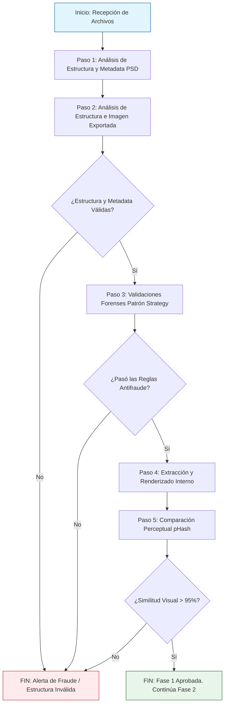

# Fase 1: Validación de Obra

## Introducción y Objetivo de la Fase 1

La **Fase 1** representa el filtro inicial y más crítico de todo el sistema de certificación. Su objetivo principal es asegurar de forma automatizada que las obras enviadas al sistema son auténticas, no han sido falsificadas mediante técnicas de copia y pegado rápido, y que la obra final (exportada) corresponde efectivamente a la obra de trabajo u obra fuente original.

**Punto Clave:** En esta fase se hace un énfasis profundo en el **análisis de la metadata y la estructura interna de los archivos**. No se confía en la extensión del archivo provista por el sistema operativo, sino que se analiza a muy bajo nivel, directamente leyendo los bytes de los archivos para entender cómo fue construido el lienzo y extraer sus metadatos intrínsecos.

## ¿Qué se analiza y cómo se analiza?

A lo largo de esta fase se analizan estructural y algorítmicamente dos tipos de archivos fundamentales:

1. **La Obra Fuente o Archivo de Trabajo (PSD):** 
   - **Qué se analiza:** El archivo de Adobe Photoshop (`.psd`) a nivel binario. Se extraen metadatos críticos como: firmas de formato (Magic Numbers), resolución, dimensiones del lienzo, y especialmente el bloque de información de capas (*Layer Info Block*). De cada capa se analiza su nombre, tamaño, opacidad, modos de fusión, y si posee efectos o máscaras.
   - **Cómo se analiza:** Se utiliza un algoritmo de lectura secuencial de bytes (`DataInputStream`). En lugar de cargar la imagen entera en RAM, se realizan saltos estratégicos (`skipBytes`) descartando bloques irrelevantes (como la data pura de píxeles), y parseando únicamente las cabeceras binarias y la metadata.
   - **Código Fuente Relevante:** Implementado principalmente en `ExtractorCapasPSD.java`.

2. **La Obra Exportada (PNG / JPEG):** 
   - **Qué se analiza:** Se valida que el archivo final posea la estructura correcta correspondiente a su formato y se extrae su metadata de densidad de píxeles (DPI) y perfiles de color (EXIF/ICC).
   - **Cómo se analiza:** Verificando firmas hexadécimales específicas al inicio del archivo (como `89 50 4E 47` para PNG o `FF D8 FF` para JPEG) y localizando los chunks de metadata (`pHYs` en PNG, `APP1` en JPEG).
   - **Código Fuente Relevante:** Implementado en `NumerosMagicos.java` y los procesadores de imágenes.

## Validaciones y Flujo del Proceso

El análisis forense se ejecuta mediante un proceso de pasos estrictos y validaciones algorítmicas, empleando patrones de diseño de software para asegurar su mantenibilidad.

### Documentación Detallada de la Fase 1

A continuación, se detalla en los siguientes documentos qué hace, cómo es el flujo, y los algoritmos específicos de cada etapa, incluyendo diagramas y código:

1. **[Análisis de Metadata y Estructura](01_analisis_metadata_y_estructura.md):** Detalla qué y cómo se extrae la información a bajo nivel, los algoritmos de parseo de metadatos, el ahorro de RAM y el código fuente relevante.
2. **[Patrones de Diseño y Validaciones](02_patrones_diseno_y_validaciones.md):** Explica las validaciones aplicadas, el patrón de diseño *Strategy*, flujos de validación (ej. detección de imagen pegada) y los códigos involucrados.
3. **[Comparación Perceptual (pHash)](03_comparacion_perceptual_phash.md):** Profundiza en la comparación matemática con hashes, el flujo del algoritmo paso a paso y el código que lo ejecuta.

## Dependencias y Construcción del JSON

Aunque en esta fase el análisis opera directamente sobre bytes binarios (`java.io.DataInputStream`), los resultados técnicos extraídos (Hashes SHA-256 y pHash perceptual) se preparan para ser serializados en un **JSON Estructurado**. El uso de un formato JSON es fundamental porque permite estandarizar los datos extraídos para que puedan ser firmados criptográficamente en fases posteriores de manera determinista.

* **Dependencias Empleadas:** Se utilizan librerías nativas de Java (`java.security.MessageDigest` para SHA-256, `java.io.*` para análisis de streams), evitando librerías externas pesadas para asegurar la máxima eficiencia. La serialización futura a JSON utilizará dependencias como **Jackson** (`com.fasterxml.jackson.core:jackson-databind`).
