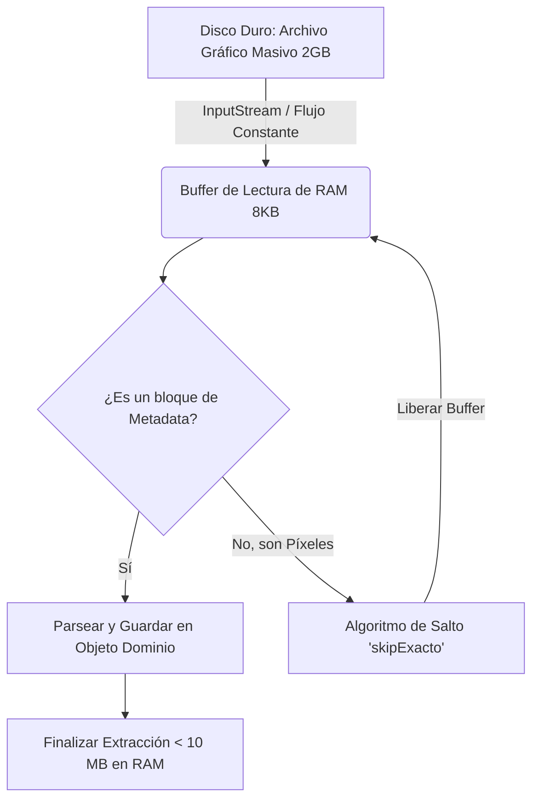
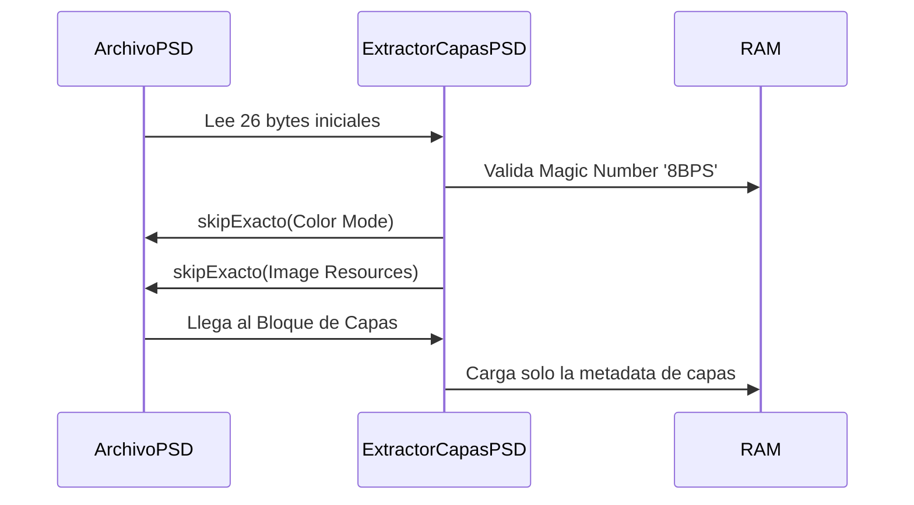

# Análisis de Metadata y Estructura (Paso 1 y Paso 2)

El primer paso dentro de la Fase 1 consiste en hacer un análisis profundo enfocado en la **extracción de metadata** y la validación de la **estructura a nivel binario** de cada archivo, diferenciando el procesamiento entre la obra de trabajo (PSD) y la obra final exportada (PNG/JPEG).

## Gestión de Memoria RAM: Previniendo el Desbordamiento (`OutOfMemoryError`)

Al procesar archivos gráficos que pueden pesar Gigabytes, es un error fatal intentar cargar el archivo completo en la memoria del servidor. Para no sobrecargar los equipos, el sistema emplea técnicas de lectura diferida y saltos estratégicos de bytes.

### Diagrama: Lectura Eficiente en RAM



En lugar de crear gigantescos arreglos de `byte[]` o usar métodos de decodificación completos (como `ImageIO.read` indiscriminadamente), el motor lee la cabecera, extrae la metadata relevante y omite la lectura de los millones de píxeles intermedios empleando un algoritmo que fuerza el avance del puntero binario sin consumir memoria:

```java
// Código completo de ExtractorCapasPSD.java para el manejo de RAM y saltos binarios
package org.example.analisis.infrastructure.adapters.processors;

import org.example.analisis.core.model.psd.EstructuraCapaPSD;
import java.io.*;
import java.util.ArrayList;
import java.util.List;
import java.util.Set;

public class ExtractorCapasPSD {

    private static final Set<String> CLAVES_AJUSTE = Set.of(
            "brit", "levl", "curv", "expA", "vibA", "hue ", "hue2",
            "blnc", "blwh", "phfl", "chnl", "selc", "thrs", "grdm",
            "nvrt", "post", "tsly", "lrFX", "vmsk", "agnc"
    );
    private static final Set<String> CLAVES_RELLENO = Set.of("SoCo", "GdFl", "PtFl");

    public static List<EstructuraCapaPSD> extraer(String path) {
        List<EstructuraCapaPSD> capas = new ArrayList<>();

        try (InputStream is = abrirStream(path)) {
            if (is == null) return capas;

            // Usamos un BufferedInputStream para mejorar el rendimiento de los saltos
            DataInputStream dis = new DataInputStream(new BufferedInputStream(is));

            // 1. Header (26 bytes)
            byte[] sig = new byte[4];
            dis.readFully(sig);
            if (!"8BPS".equals(new String(sig))) return capas;

            int version = dis.readUnsignedShort();
            boolean isPsb = (version == 2);
            skipExacto(dis, 6); // Reservado
            skipExacto(dis, 2); // Canales
            skipExacto(dis, 4); // Alto
            skipExacto(dis, 4); // Ancho
            skipExacto(dis, 2); // Profundidad
            skipExacto(dis, 2); // Modo Color

            // 2. Color Mode Data
            long colorModeLen = readUint32(dis);
            skipExacto(dis, colorModeLen);

            // 3. Image Resources
            long resourceLen = readUint32(dis);
            skipExacto(dis, resourceLen);

            // 4. Layer and Mask Information
            long section4Len = isPsb ? dis.readLong() : readUint32(dis);

            if (section4Len <= 0) return capas;

            // ── Layer Info Block ──
            long layerInfoLen = isPsb ? dis.readLong() : readUint32(dis);
            if (layerInfoLen <= 0) return capas;

            short layerCountRaw = dis.readShort();
            int layerCount = Math.abs(layerCountRaw);

            for (int i = 0; i < layerCount; i++) {
                int top = dis.readInt();
                int left = dis.readInt();
                int bottom = dis.readInt();
                int right = dis.readInt();

                int numCh = dis.readUnsignedShort();
                for (int c = 0; c < numCh; c++) {
                    dis.readShort(); // ID Canal
                    skipExacto(dis, isPsb ? 8 : 4); // Tamaño datos canal
                }

                skipExacto(dis, 4); // Firma "8BIM"
                byte[] blendBytes = new byte[4];
                dis.readFully(blendBytes);
                String blendKey = new String(blendBytes);

                int opacity = dis.readUnsignedByte();
                int clipping = dis.readUnsignedByte();
                int flags = dis.readUnsignedByte();
                dis.readByte(); // Filler

                int extraLen = dis.readInt();
                byte[] extra = new byte[extraLen];
                dis.readFully(extra);

                ExtraParseado ep = parsearExtra(extra);

                capas.add(EstructuraCapaPSD.builder()
                        .indice(i + 1)
                        .nombre(ep.nombre())
                        .tipo(ep.tipo())
                        .blendModeKey(blendKey.trim())
                        .blendModeNombre(obtenerBlendModeNombre(blendKey.trim()))
                        .opacidadRaw(opacity)
                        .visible((flags & 0x02) == 0)
                        .bloqueada((flags & 0x01) != 0)
                        .esClippingMask(clipping == 1)
                        .tieneMascaraCapa(ep.tieneMascara())
                        .tieneEfectos(ep.tieneEfectos())
                        .ancho(right - left)
                        .alto(bottom - top)
                        .offsetX(left)
                        .offsetY(top)
                        .build());
            }

        } catch (Exception e) {
            System.err.println("[ExtractorCapas] Error: " + e.getMessage());
        }

        return capas;
    }

    private static String obtenerBlendModeNombre(String key) {
        return switch (key) {
            case "norm" -> "Normal";
            case "dark" -> "Darken";
            case "mul " -> "Multiply";
            case "idiv" -> "Color Burn";
            case "lurn" -> "Linear Burn";
            case "lite" -> "Lighten";
            case "scrn" -> "Screen";
            case "div " -> "Color Dodge";
            case "lddg" -> "Linear Dodge";
            case "over" -> "Overlay";
            case "slic" -> "Soft Light";
            case "hlic" -> "Hard Light";
            case "vlic" -> "Vivid Light";
            case "llic" -> "Linear Light";
            case "plic" -> "Pin Light";
            case "hMix" -> "Hard Mix";
            case "diff" -> "Difference";
            case "smud" -> "Exclusion";
            case "fsub" -> "Subtract";
            case "fdiv" -> "Divide";
            case "hue " -> "Hue";
            case "sat " -> "Saturation";
            case "colr" -> "Color";
            case "lum " -> "Luminosity";
            default -> "Desconocido (" + key + ")";
        };
    }

    private static void skipExacto(DataInputStream dis, long n) throws IOException {
        long totalSaltado = 0;
        while (totalSaltado < n) {
            long saltado = dis.skip(n - totalSaltado);
            if (saltado <= 0) {
                dis.readByte();
                totalSaltado++;
            } else {
                totalSaltado += saltado;
            }
        }
    }

    private static long readUint32(DataInputStream dis) throws IOException {
        return dis.readInt() & 0xFFFFFFFFL;
    }

    private record ExtraParseado(String nombre, boolean tieneMascara, boolean tieneEfectos, EstructuraCapaPSD.Tipo tipo) {}

    private static ExtraParseado parsearExtra(byte[] extra) {
        String nombre = "<sin nombre>";
        boolean tieneMasc = false;
        boolean tieneEfect = false;
        EstructuraCapaPSD.Tipo tipo = EstructuraCapaPSD.Tipo.NORMAL;

        try (DataInputStream d = new DataInputStream(new ByteArrayInputStream(extra))) {
            int maskLen = d.readInt();
            if (maskLen > 0) { tieneMasc = true; d.skipBytes(maskLen); }

            int blendLen = d.readInt();
            if (blendLen > 0) d.skipBytes(blendLen);

            int nameLen = d.readUnsignedByte();
            byte[] nameBytes = new byte[nameLen];
            d.readFully(nameBytes);
            nombre = new String(nameBytes, "UTF-8").trim();

            int pad = (4 - ((1 + nameLen) % 4)) % 4;
            if (pad > 0) d.skipBytes(pad);

            while (d.available() >= 12) {
                byte[] sig = new byte[4];
                d.readFully(sig);
                if (!"8BIM".equals(new String(sig)) && !"8B64".equals(new String(sig))) break;

                byte[] keyB = new byte[4];
                d.readFully(keyB);
                String key = new String(keyB).trim();
                int len = d.readInt();
                int totalLen = len + (len % 2); // Padding par

                if (key.equals("luni")) {
                    int uLen = d.readInt();
                    StringBuilder sb = new StringBuilder();
                    for (int u = 0; u < uLen / 2; u++) sb.append((char) d.readUnsignedShort());
                    nombre = sb.toString().trim();
                    d.skipBytes(totalLen - (uLen + 4));
                } else if (key.equals("lsct")) {
                    tipo = EstructuraCapaPSD.Tipo.GRUPO;
                    d.skipBytes(totalLen);
                } else {
                    if (CLAVES_AJUSTE.contains(key)) tipo = EstructuraCapaPSD.Tipo.AJUSTE;
                    if (CLAVES_RELLENO.contains(key)) tipo = EstructuraCapaPSD.Tipo.RELLENO;
                    if (key.equals("TySh")) tipo = EstructuraCapaPSD.Tipo.TEXTO;
                    if (key.equals("lfx2")) tieneEfect = true;
                    d.skipBytes(totalLen);
                }
            }
        } catch (Exception ignored) {}
        return new ExtraParseado(nombre, tieneMasc, tieneEfect, tipo);
    }

    private static InputStream abrirStream(String path) throws IOException {
        File f = new File(path);
        return f.exists() ? new FileInputStream(f) : null;
    }
}
```

---

## 1. Archivo de Trabajo: PSD (Adobe Photoshop)

### Análisis de Metadata (PSD)

**Librerías / Dependencias Involucradas:**
- `java.io.DataInputStream` (Nativa): Se usa la librería nativa de Java, lo que permite la máxima velocidad de ejecución y nulo sobrecosto de memoria para parsear bytes en crudo y extraer la metadata de capas.
- `com.twelvemonkeys.imageio:imageio-psd:3.11.0`: Usada en pasos posteriores para renderizar el PSD, pero evitada en este paso inicial para no ahogar la RAM.

**¿Cómo se analiza?**
Se aplican las especificaciones oficiales del formato de Adobe. Se leen exclusivamente las claves de registro binario (firmas `8BIM`, `8B64`) en la sección final de cada capa para identificar sus atributos y herramientas usadas.

```java
// Extracción de efectos y tipos (Fragmento de ExtractorCapasPSD)
private static final Set<String> CLAVES_AJUSTE = Set.of("brit", "levl", "curv", "hue ");
// ... lectura a nivel de byte
if (CLAVES_AJUSTE.contains(key)) tipo = EstructuraCapaPSD.Tipo.AJUSTE; // Identifica Capa de Ajuste
if (key.equals("TySh")) tipo = EstructuraCapaPSD.Tipo.TEXTO;
if (key.equals("lfx2")) tieneEfect = true; // Detecta Sombras o Resplandores
```

### Análisis de Estructura (PSD)

**¿Cómo se analiza?**
La estructura se valida asegurando que el *Magic Number* del archivo corresponda a `8BPS`, que su versión sea `1` (PSD) o `2` (PSB), y que contenga un *Layer Info Block* intacto. Si carece de estas secciones modulares obligatorias, el archivo se considera corrupto o falso.



---

## 2. Archivos Finales Exportados: PNG y JPEG

### Análisis de Metadata (PNG/JPEG)

**Librerías / Dependencias Involucradas:**
- `com.drewnoakes:metadata-extractor:2.20.0`: Es el motor principal para leer los metadatos ocultos. Se encarga de navegar los *directorios* de metadatos (EXIF, ICC, IPTC) sin decodificar los píxeles, ahorrando RAM masivamente.
- `org.apache.commons:commons-imaging:1.0-alpha3`: Dependencia empleada para manejo forense de XMP/EXIF.

**¿Cómo se analiza?**
Se emplea un modelo arquitectónico de extractores iterativos. En lugar de depender de una sola etiqueta, el sistema ejecuta múltiples delegados (estrategias) para ubicar el DPI (Densidad de Píxeles), resolución y perfiles en diferentes directorios dependiendo si es un archivo web, de cámara o exportado por software especializado.

```java
// MetadatosImagenService.java completo
package org.example.analisis.infrastructure.adapters.processors;

import com.drew.imaging.ImageMetadataReader;
import com.drew.metadata.Metadata;
import org.example.analisis.infrastructure.adapters.extractors.MetadataExtractor;
import org.example.analisis.core.model.imagen.MetadatosImagen;
import org.example.analisis.infrastructure.adapters.extractors.imagen.*;

import java.io.File;
import java.util.Arrays;
import java.util.List;

public class MetadatosImagenService {

    private final List<MetadataExtractor<MetadatosImagen.MetadatosImagenBuilder>> extractores;

    public MetadatosImagenService() {
        this.extractores = Arrays.asList(
                new FileType(), // Identifica formato y extensión
                new Png(),      // Datos PNG (pHYs, gAMA, sRGB)
                new Jpeg(),     // Dimensiones JPG
                new Jfif(),     // DPI de JPG
                new Exif(),     // Respaldo de DPI
                new Icc()       // Perfil de color
        );
    }

    public MetadatosImagen procesarArchivo(File archivo) {
        MetadatosImagen.MetadatosImagenBuilder builder = MetadatosImagen.builder();

        try {
            Metadata metadata = ImageMetadataReader.readMetadata(archivo);

            for (MetadataExtractor<MetadatosImagen.MetadatosImagenBuilder> extractor : extractores) {
                try {
                    extractor.extraer(metadata, builder);
                } catch (Exception ex) {
                    System.err.println("Advertencia: El extractor " + extractor.getClass().getSimpleName() +
                            " falló, pero el análisis continuará. Error: " + ex.getMessage());
                }
            }

        } catch (Exception e) {
            System.err.println("Error crítico procesando la imagen " + archivo.getName() + ": " + e.getMessage());
        }

        return builder.build();
    }
}
```

### Análisis de Estructura (PNG/JPEG)

**¿Cómo se analiza?**
De igual manera que en PSD, un atacante podría enviar un archivo malicioso o falso (ej. `virus.exe`) renombrado como `obra.png`. El análisis estructural ignora la extensión del sistema operativo y lee los primeros bytes del archivo en memoria para validarlos contra un diccionario interno de *Números Mágicos*.

```java
// NumerosMagicos.java completo
package org.example.analisis.infrastructure.adapters.processors;

import java.io.File;
import java.io.FileInputStream;
import java.io.IOException;

public class NumerosMagicos {  // Firmas hexadecimales
    private static final byte[] PNG_SIGNATURE = {(byte) 0x89, 0x50, 0x4E, 0x47, 0x0D, 0x0A, 0x1A, 0x0A};
    private static final byte[] JPEG_SIGNATURE = {(byte) 0xFF, (byte) 0xD8, (byte) 0xFF};
    private static final byte[] PSD_SIGNATURE = {0x38, 0x42, 0x50, 0x53}; // "8BPS"

    public static String detectarFormatoReal(File archivo) {
        byte[] encabezado = new byte[8];
        try (FileInputStream fis = new FileInputStream(archivo)) {
            if (fis.read(encabezado) < 4) return "DESCONOCIDO";
            return detectarFormatoReal(encabezado);
        } catch (IOException e) {
            return "ERROR_LECTURA";
        }
    }

    public static String detectarFormatoReal(byte[] datos) {
        if (datos == null || datos.length < 4) return "DESCONOCIDO";
        if (compararBytes(datos, PSD_SIGNATURE, 4)) return "PSD";
        if (datos.length >= 8 && compararBytes(datos, PNG_SIGNATURE, 8)) return "PNG";
        if (datos.length >= 3 && compararBytes(datos, JPEG_SIGNATURE, 3)) return "JPEG";
        return "OTRO";
    }

    private static boolean compararBytes(byte[] a, byte[] b, int n) {
        for (int i = 0; i < n; i++) {
            if (a[i] != b[i]) return false;
        }
        return true;
    }
}
```

Gracias a este esquema dividido de validación, el sistema extrae solo lo que necesita (metadata) y asegura las bases de autenticidad (estructura), optimizando y reduciendo radicalmente el consumo de RAM de los equipos certificadores.
