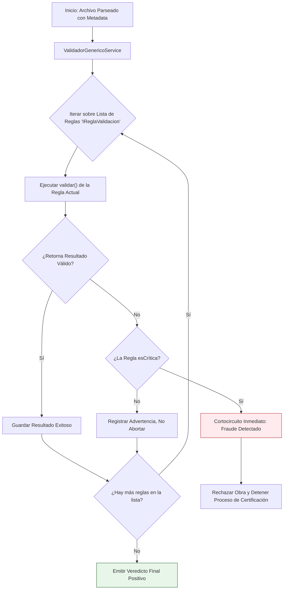

# Validaciones de Archivo y Patrones de Diseño (Paso 3)

Una vez que la metadata y estructura cruda ha sido extraída (PSD, PNG o JPEG), el sistema aplica **reglas de negocio forenses**. El objetivo de estas validaciones es identificar inconsistencias técnicas que apunten a que la obra no es original o es fraudulenta (e.g. copiar y pegar de internet).

## Patrón de Diseño Empleado: Strategy

Para programar estas validaciones se utilizó el **Patrón de Diseño Strategy**. Este patrón permite definir una familia de algoritmos (reglas), encapsular cada uno, y hacerlos intercambiables. 

**¿Por qué usar Strategy?**
- Permite agregar nuevas reglas forenses en el futuro sin modificar el código core del validador.
- Facilita activar o desactivar reglas según las configuraciones del sistema.
- Permite separar reglas "críticas" (que abortan el proceso inmediatamente) de advertencias menores.

### Diagrama de Flujo: Validaciones y Patrón Strategy



### Código Relevante: Implementación de Strategy

El contrato para cualquier validación se define mediante una interfaz genérica que establece el comportamiento esperado:

```java
// IReglaValidacion.java
package org.example.analisis.core.rules;
import org.example.analisis.core.model.validacion.ResultadoValidacion;

public interface IReglaValidacion<T> {
    ResultadoValidacion validar(T objeto);
    boolean esCritica();
}
```

## Validación Concreta: Fraude por Imagen Pegada

Uno de los flujos de validación más importantes es detectar la "Imagen Pegada" (*Flattened Image*). Un defraudador podría crear un PSD, pegar una imagen final de internet en una única capa y enviarlo. 

### Algoritmo de Validación

**¿Qué hace la regla?**
1. Analiza el total de capas. Si el documento tiene más de 5 capas, asume que existe complejidad y pasa la validación.
2. Si tiene 5 o menos capas, recorre capa por capa buscando coincidencias sospechosas.
3. Se verifica si el tamaño de la capa (ancho y alto) coincide exactamente con el tamaño total del lienzo.
4. Se revisa la metadata: Si la capa ocupa todo el lienzo, pero *no tiene* máscaras de capa, *no tiene* efectos (Drop shadow, resplandores), *no es* clipping mask y su modo de fusión es "Normal", se clasifica como Fraude.

### Código Relevante: ReglaImagenPegada

La clase implementa la interfaz de la estrategia.

```java
package org.example.analisis.core.rules.psd;

import org.example.analisis.core.rules.IReglaValidacion;
import org.example.analisis.core.model.psd.ArchivoPSD;
import org.example.analisis.core.model.validacion.ResultadoValidacion;
import org.example.analisis.core.model.psd.EstructuraCapaPSD;

public class ReglaImagenPegada implements IReglaValidacion<ArchivoPSD> {
    @Override
    public ResultadoValidacion validar(ArchivoPSD psd) {
        // SI TIENE MUCHAS CAPAS, NO PUEDE SER UN SIMPLE "COPY-PASTE" DE INTERNET
        // Ponemos un umbral de 5 capas. Si tiene más, esta regla se aprueba automáticamente.
        if (psd.getCapas().size() > 5) {
            return ResultadoValidacion.builder()
                    .nombreRegla("Fraude: Imagen Pegada")
                    .esValido(true)
                    .mensaje("Estructura compleja detectada (" + psd.getCapas().size() + " capas). No es una imagen plana.")
                    .build();
        }

        // SI TIENE POCAS CAPAS (<=5), BUSCAMOS SI ES UNA IMAGEN PLANA
        int lienzoW = psd.getMetadatos().getAnchoImagen();
        int lienzoH = psd.getMetadatos().getAltoImagen();

        for (EstructuraCapaPSD capa : psd.getCapas()) {
            if (capa.getAncho() == lienzoW && capa.getAlto() == lienzoH) {
                if (!capa.isTieneMascaraCapa() && !capa.isTieneEfectos() &&
                        !capa.isEsClippingMask() && "norm".equals(capa.getBlendModeKey())) {

                    return ResultadoValidacion.builder()
                            .nombreRegla("Fraude: Imagen Pegada")
                            .esValido(false)
                            .mensaje("Se detectó una capa única que cubre todo el lienzo sin edición técnica.")
                            .build();
                }
            }
        }

        return ResultadoValidacion.builder()
                .nombreRegla("Fraude: Imagen Pegada")
                .esValido(true)
                .mensaje("OK")
                .build();
    }

    @Override public boolean esCritica() { return true; }
}
```

Esta separación de responsabilidades asegura que las reglas puedan ser testeadas de manera aislada (Unit Testing) y el flujo global permanezca robusto.
