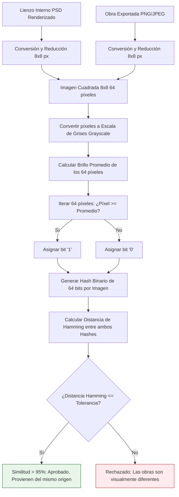

# Comparación Perceptual con pHash (Paso 4)

El último paso de la Fase 1 es la validación visual y comparativa: asegurar que la imagen exportada (PNG o JPEG) enviada como obra final, proviene lógicamente del archivo de trabajo (PSD).

**¿Qué se analiza y por qué?**
No podemos usar algoritmos de hashes criptográficos tradicionales (como MD5 o SHA-256) ya que están diseñados para tener un "Efecto Avalancha"; si un solo píxel varía levemente de color al comprimir a JPEG, el hash MD5 cambiará totalmente (0% de similitud). 

Por lo tanto, empleamos un **Hash Perceptual (pHash)**, un algoritmo matemático diseñado para comparar contenido visual y detectar similitudes ignorando diferencias sutiles (compresión, pequeños filtros, marcas de agua mínimas).

## Flujo de Comparación Perceptual

El algoritmo evalúa la estructura de "bajas frecuencias" (la forma y silueta macro de la obra) de ambos archivos. 

### Diagrama de Flujo: Algoritmo pHash Detallado



## Algoritmos y Código Relevante (`CalculadorPHash.java`)

La clase `CalculadorPHash` encapsula la lógica para crear el hash y medir la similitud. A continuación se presenta el código completo de la clase, que integra tanto la generación de la cadena binaria como el cálculo de similitud mediante la distancia de Hamming:

```java
package org.example.analisis.core.service;

import java.awt.*;
import java.awt.image.BufferedImage;

public class CalculadorPHash {

    public String generarHash(BufferedImage imagen) {
        if (imagen == null) {
            return "0".repeat(64);
        }
        // 1. Redimensionar a 8x8 para normalizar
        Image escala = imagen.getScaledInstance(8, 8, Image.SCALE_SMOOTH);
        BufferedImage miniatura = new BufferedImage(8, 8, BufferedImage.TYPE_BYTE_GRAY);

        Graphics g = miniatura.getGraphics();
        g.drawImage(escala, 0, 0, null);
        g.dispose();

        // 2. Calcular brillo promedio
        double sumaGris = 0;
        for (int y = 0; y < 8; y++) {
            for (int x = 0; x < 8; x++) {
                sumaGris += (miniatura.getRGB(x, y) & 0xFF);
            }
        }
        double promedio = sumaGris / 64.0;

        // 3. Generar cadena binaria de 64 bits
        StringBuilder hash = new StringBuilder();
        for (int y = 0; y < 8; y++) {
            for (int x = 0; x < 8; x++) {
                hash.append((miniatura.getRGB(x, y) & 0xFF) >= promedio ? "1" : "0");
            }
        }
        return hash.toString();
    }

    public double compararSimilitud(String hash1, String hash2) {
        if (hash1 == null || hash2 == null || hash1.length() != hash2.length()) {
            return 0.0;
        }
        int distanciaHamming = 0;
        for (int i = 0; i < hash1.length(); i++) {
            if (hash1.charAt(i) != hash2.charAt(i)) {
                distanciaHamming++;
            }
        }
        // Retorna el porcentaje de parecido
        return (1.0 - (distanciaHamming / 64.0)) * 100.0;
    }
}
```

Al calcular esta similitud visual matemática, el flujo descarta cualquier fraude en el que el artista envíe un archivo PSD de una obra completamente distinta al lienzo PNG que intenta registrar, garantizando la trazabilidad forense.
