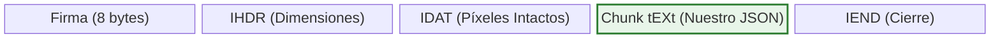
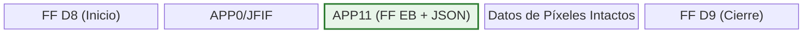

# 1. Esteganografía Forense y Metadata no Destructiva

## La Paradoja de la Esteganografía en Ciencias Forenses

**¿Por qué NO inyectamos la información dentro de los píxeles (método LSB)?**

La técnica esteganográfica tradicional más famosa es LSB (*Least Significant Bit*), que consiste en alterar sutilmente el valor de color de los píxeles menos significativos de una imagen para ocultar letras. Sin embargo, en un entorno de **Ciencia Forense Digital**, esta técnica está estrictamente prohibida. Alterar aunque sea un solo bit dentro de la matriz visual de los píxeles modificaría de manera irreversible el Hash original (SHA-256) de la obra. Es decir, al esconder la firma, estaríamos **destruyendo y adulterando la evidencia principal**.

Por esta razón, la inyección debe ser 100% no destructiva, operando a nivel de la estructura binaria (metadata) externa a la trama visual.

## Diagramas de Inyección no destructiva

### 1. Inyección de JSON en PNG (Chunk `tEXt`)
El formato PNG se compone de "Chunks" o pedazos de información. Insertamos un nuevo bloque `tEXt` personalizado justo antes del bloque final de cierre (`IEND`), sin tocar el bloque de píxeles (`IDAT`).



### 2. Inyección de JSON en JPEG (Segmento `APP11`)
El formato JPEG se basa en segmentos identificados por marcadores hexadecimales. Creamos un segmento `APP11` (FF EB) reservado exclusivamente para la certificación forense, manteniéndolo separado del EXIF tradicional (`APP1`).



## Algoritmo de Inyección en Metadata (`AdaptadorEsteganografia.java` Parte 1)

El siguiente código muestra cómo se calculan las posiciones de bytes y se insertan los nuevos metadatos calculando los comprobantes de redundancia (como CRC32 para PNG) para no corromper la integridad del archivo.

```java
// Fragmentos de AdaptadorEsteganografia.java relacionados a Metadata
package org.example.analisis.infrastructure.adapters.outbound;

import org.example.analisis.core.ports.outbound.ServicioEsteganograficoPort;
import org.example.analisis.infrastructure.adapters.processors.NumerosMagicos;

import java.io.ByteArrayOutputStream;
import java.io.IOException;
import java.nio.ByteBuffer;
import java.nio.charset.StandardCharsets;
import java.util.Arrays;
import java.util.zip.CRC32;

public class AdaptadorEsteganografia implements ServicioEsteganograficoPort {

    // ... (Marcador mágico omitido para esta sección)

    @Override
    public byte[] procesar(byte[] renderOriginal, String jsonPayload) {
        String formato = NumerosMagicos.detectarFormatoReal(renderOriginal);

        if ("PNG".equals(formato)) {
            return inyectarMetadataPNG(renderOriginal, jsonPayload);
        } else if ("JPEG".equals(formato)) {
            return inyectarMetadataJPEG(renderOriginal, jsonPayload);
        } else {
            // Fallback genérico estructurado si no es ni PNG ni JPEG
            try (ByteArrayOutputStream baos = new ByteArrayOutputStream()) {
                baos.write(renderOriginal);
                baos.write("---JSON-PAYLOAD---".getBytes(StandardCharsets.UTF_8));
                baos.write(jsonPayload.getBytes(StandardCharsets.UTF_8));
                return baos.toByteArray();
            } catch (IOException e) {
                throw new RuntimeException("Error en inyección genérica: " + e.getMessage(), e);
            }
        }
    }

    private byte[] inyectarMetadataPNG(byte[] imageBytes, String jsonPayload) {
        try {
            // Estructura de chunk tEXt de PNG: Keyword + nulo + Texto
            String keyword = "JSON-PAYLOAD";
            byte[] keywordBytes = keyword.getBytes(StandardCharsets.ISO_8859_1);
            byte[] textBytes = jsonPayload.getBytes(StandardCharsets.UTF_8);
            
            byte[] chunkData = new byte[keywordBytes.length + 1 + textBytes.length];
            System.arraycopy(keywordBytes, 0, chunkData, 0, keywordBytes.length);
            chunkData[keywordBytes.length] = 0; // Separador nulo obligatorio
            System.arraycopy(textBytes, 0, chunkData, keywordBytes.length + 1, textBytes.length);
            
            byte[] chunkType = "tEXt".getBytes(StandardCharsets.ISO_8859_1);
            
            // Calcular CRC32 (Estándar estructural obligatorio en PNG)
            CRC32 crc = new CRC32();
            crc.update(chunkType);
            crc.update(chunkData);
            int crcValue = (int) crc.getValue();
            
            // IEND (marcador de fin) siempre es los últimos 12 bytes del PNG
            if (imageBytes.length < 12) return imageBytes;
            int insertPosition = imageBytes.length - 12;
            
            ByteArrayOutputStream baos = new ByteArrayOutputStream();
            baos.write(imageBytes, 0, insertPosition); // Malla de píxeles intacta
            
            // Escribir nuestro Chunk tEXt personalizado
            baos.write(ByteBuffer.allocate(4).putInt(chunkData.length).array()); // Longitud
            baos.write(chunkType); // Tipo de chunk (tEXt)
            baos.write(chunkData); // Datos Payload
            baos.write(ByteBuffer.allocate(4).putInt(crcValue).array()); // Checksum CRC
            
            // Escribir el IEND original para no corromper la imagen
            baos.write(imageBytes, insertPosition, 12);
            
            return baos.toByteArray();
        } catch (IOException e) {
            throw new RuntimeException("Error inyectando chunk tEXt en PNG", e);
        }
    }

    private byte[] inyectarMetadataJPEG(byte[] imageBytes, String jsonPayload) {
        try {
            if (imageBytes.length < 2 || imageBytes[0] != (byte)0xFF || imageBytes[1] != (byte)0xD8) {
                return imageBytes;
            }
            
            byte[] payloadBytes = jsonPayload.getBytes(StandardCharsets.UTF_8);
            // Usaremos segmento APP11 (FF EB) para evitar conflictos con EXIF (APP1)
            int segmentLength = 2 + payloadBytes.length; // 2 bytes de longitud + datos
            if (segmentLength > 65535) {
                throw new IllegalArgumentException("Payload JSON demasiado grande para un segmento JPEG");
            }
            
            ByteArrayOutputStream baos = new ByteArrayOutputStream();
            baos.write(0xFF); // SOI (Start Of Image)
            baos.write(0xD8);
            
            baos.write(0xFF);
            baos.write(0xEB); // Marcador APP11 (Nuestro sector esteganográfico)
            
            baos.write((segmentLength >> 8) & 0xFF);
            baos.write(segmentLength & 0xFF);
            
            baos.write(payloadBytes);
            
            // Escribir el resto de la imagen intacta (píxeles y otros metadatos)
            baos.write(imageBytes, 2, imageBytes.length - 2);
            
            return baos.toByteArray();
        } catch (IOException e) {
            throw new RuntimeException("Error inyectando metadata en JPEG", e);
        }
    }
}
```
