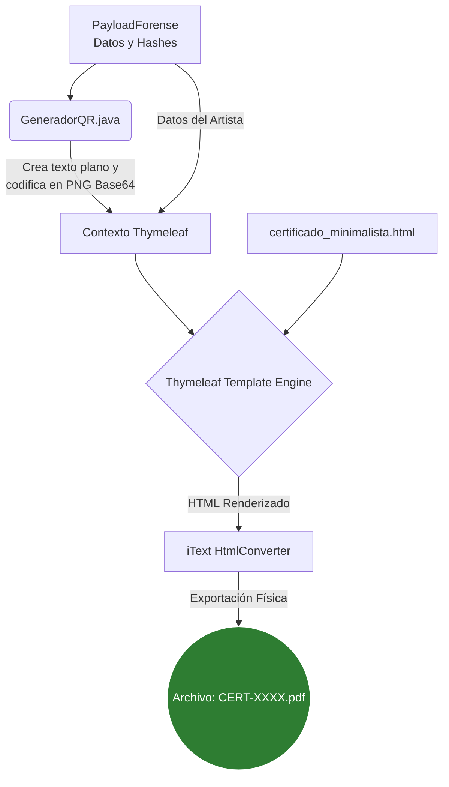
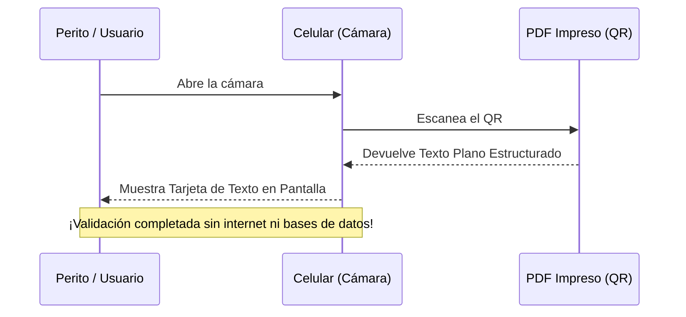

# Generación de Certificado PDF Minimalista (Autónomo)

Este documento detalla la arquitectura, el diseño y las dependencias para la generación automática del "Certificado de Autenticidad Digital" en formato PDF. Este proceso es completamente **offline y no requiere base de datos**, asegurando la perpetuidad de la prueba forense.

## 1. El Concepto Visual y Estructura

El certificado adopta un diseño moderno y minimalista, optimizado para la legibilidad humana, mientras que los datos criptográficos "pesados" se encapsulan dentro de un Código QR inteligente.

### Flujo de Generación (Diagrama)



## 2. El Código QR Autónomo (Texto Plano)

La innovación principal es el **QR Autónomo**. Al escanear este QR con la cámara de cualquier teléfono, **no se abre una página web ni requiere conexión a internet**. 

En lugar de un enlace, el QR contiene un bloque estructurado de texto plano que salta directamente a la pantalla del usuario.

### Flujo de Verificación del Usuario



**Ejemplo del contenido inyectado en el QR:**
```text
--- CERTIFICADO FORENSE UCE ---
ID: CERT-2026-9941A
Autor: Sophia Vance
Obra: El Eco del Mañana
SHA-256: e3b0c44298fc1c149afbf4c8996fb92427ae41e4649b934ca495991b7852b855
Validez: EMITIDO_VALIDO
-------------------------------
```

### ¿Por qué texto plano y no un JSON crudo o un enlace web?

1. **Independencia de Bases de Datos (Anti-Fragilidad):** Si el QR fuera un enlace (ej. `https://mi-sistema.com/verificar/CERT-XXXX`), la validación dependería de que el servidor, el dominio y la base de datos sigan activos. En un entorno forense a largo plazo (décadas), los servidores pueden ser dados de baja. Un QR con los datos y hashes criptográficos en texto plano permite que la prueba sea auditada y verificada de forma **autónoma y perpetua (offline)**, sin depender de infraestructura de terceros.
2. **Capacidad del QR y Legibilidad Humana:** El sistema **no** inyecta el JSON completo (`PayloadForense`) directamente en el QR. Un JSON con toda la estructura de la firma digital y esteganografía es demasiado largo, lo que generaría un QR excesivamente denso y difícil de escanear. Al extraer solo los campos clave y presentarlos como un bloque de texto estructurado, garantizamos que la cámara del celular lo lea instantáneamente y que un perito o juez pueda leer la información al primer vistazo.
3. **Seguridad y Prevención de Phishing:** Al evitar el uso de enlaces web (`URLs`), se mitiga el vector de ataque más común: la suplantación de identidad (Phishing). Un atacante podría generar un QR manipulado que redirija al usuario a una página web falsa (ej. `https://mi-s1stema-falso.com`) diseñada para mostrar un certificado de autenticidad fraudulento. Al entregar directamente los datos firmados en texto plano, la validación se centra en la verificación criptográfica del contenido, evitando que los usuarios confíen ciegamente en lo que muestra una URL externa potencialmente maliciosa.
*(Nota: El JSON completo con la carga técnica se preserva incrustado en la obra mediante esteganografía y en los metadatos del PDF).*


## 3. Dependencias Técnicas (`build.gradle.kts`)

Para lograr la conversión de Datos -> HTML -> PDF, el sistema utiliza el estándar de la industria, evitando librerías obsoletas (eliminamos Flying Saucer y código basura antiguo).

```kotlin
// 1. ZXing: Para la codificación del QR Autónomo
implementation("com.google.zxing:core:3.5.3")
implementation("com.google.zxing:javase:3.5.3")

// 2. Thymeleaf: Motor de plantillas para inyectar variables en HTML
implementation("org.thymeleaf:thymeleaf:3.1.2.RELEASE")

// 3. iText 7 html2pdf: Conversor profesional de HTML a PDF
implementation("com.itextpdf:itext7-core:7.2.5")
implementation("com.itextpdf:html2pdf:4.0.5")
```

## 4. Estructura de Clases

Para mantener una **Arquitectura Hexagonal**, la lógica se separa en:

1. **`GeneradorQR.java` (Capa Utilitaria):** 
   Convierte los datos a un bloque de texto y usa `QRCodeWriter` para generar la imagen PNG en formato Base64.
2. **`certificado_minimalista.html` (Capa de Presentación):** 
   Usa `` para inyectar el QR en memoria, sin escribir archivos temporales.
3. **`GeneradorCertificadoPdf.java` (Caso de Uso):** 
   Orquesta a Thymeleaf y llama a `HtmlConverter.convertToPdf()` (de iText) para guardar el PDF final.

> [!TIP]
> **Separación de Funciones:** Este proceso de generación de PDF es **independiente** del proceso de Esteganografía (EOF). Puedes ejecutar ambos para tener el certificado físico (PDF) y la imagen digital sellada (PNG) al mismo tiempo.
